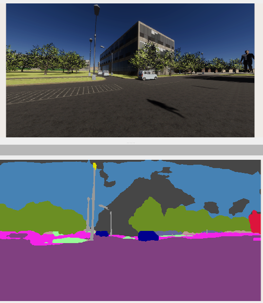

# perception_docker_images

Instructions on how to utilize perception docker images for dobbie. 

## 1. Image segmentation with [mmsegmentation](https://github.com/open-mmlab/mmsegmentation). 


Pull the docker image; 

```bash
docker pull jediofgever/ros2_ws:latest
```

THe base image for `jediofgever/ros2_ws:latest` is based on Nvidia's CUDA enabled images. Now create a runtime container from this image with the following;

```bash
sudo docker run --net host --gpus all --env "DISPLAY" -it jediofgever/ros2_ws:latest
```

Ensure that NVIDIA GPU is in usable state with;

```bash
root@atas-ZBOX-EN72080V-EN72070V-EN52060V-EN51660T:~/workspace# nvidia-smi 
Sun Apr  9 15:47:00 2023       
+---------------------------------------------------------------------------------------+
| NVIDIA-SMI 530.30.02              Driver Version: 530.30.02    CUDA Version: 12.1     |
|-----------------------------------------+----------------------+----------------------+
| GPU  Name                  Persistence-M| Bus-Id        Disp.A | Volatile Uncorr. ECC |
| Fan  Temp  Perf            Pwr:Usage/Cap|         Memory-Usage | GPU-Util  Compute M. |
|                                         |                      |               MIG M. |
|=========================================+======================+======================|
|   0  NVIDIA GeForce RTX 2060         On | 00000000:01:00.0 Off |                  N/A |
| N/A   64C    P2               75W /  80W|   3001MiB /  6144MiB |     72%      Default |
|                                         |                      |                  N/A |
+-----------------------------------------+----------------------+----------------------+
                                                                                         
+---------------------------------------------------------------------------------------+
| Processes:                                                                            |
|  GPU   GI   CI        PID   Type   Process name                            GPU Memory |
|        ID   ID                                                             Usage      |
|=======================================================================================|
+---------------------------------------------------------------------------------------+
```

Source the ROS2 workspace and start the segmentation inference node; 

```bash
cd ros2_ws/ 
source install/setup.bash
ros2 run mmseg_infer infer
```



Assuming a `sensor_msgs::msg::Image` is being published to `/dobbie/sensing/camera/traffic_light/image_raw`, The image inference node will run the default image segmentor which is [danet](https://github.com/open-mmlab/mmsegmentation/tree/main/configs/danet), trained on CityScapes dataset. The models must be converted to TensorRT, e.g. the danet takes ~70ms to process. 

If node inference is succeeded, the segmented image will be published to a topic named `segmented_image`.

### 1.1 Rebuild the workspace

The MMDeploy is a library used to convert mmsegmentation models to real-time capable TensorRT models. So we need to link it to our inference node. 

```bash
cd ros2_ws/ 
source install/setup.bash
colcon build --cmake-args -DMMDeploy_DIR=/root/workspace/mmdeploy/build/install/lib/cmake/MMDeploy
```

### 1.2 Converting more models to TensorRT

Go to model zoo in [mmsegmentation](https://github.com/open-mmlab/mmsegmentation). Download a pretrained model with wget. Then ;

```bash
cd mmdeploy
python3 ./tools/deploy.py configs/mmseg/segmentation_tensorrt-fp16_static-1024x1024.py \
../mmsegmentation/configs/segformer/segformer_mit-b5_8xb1-160k_cityscapes-1024x1024.py \
../segformer_mit-b5_8x1_1024x1024_160k_cityscapes_20211206_072934-87a052ec.pth \
../mmsegmentation/demo/demo.png \
--work-dir work-dir \
--show --dump-info \
--device cuda:0
```

The files will be dumped to `mmdeploy/work-dir`, create a new folder under `workspace` (e.g. XXmodels), then move generated files to newly created folder. 

You can run with newly deployed models 

```bash
ros2 run mmseg_infer infer -os-args -p model:=/root/workspace/danetmodels/ -p device:=cuda -p pallete:=cityscapes
```

### 1.3 Be aware offs
* Use cyclone dds


## 2. Using OpenPCDet docker image for point cloud perception

todo